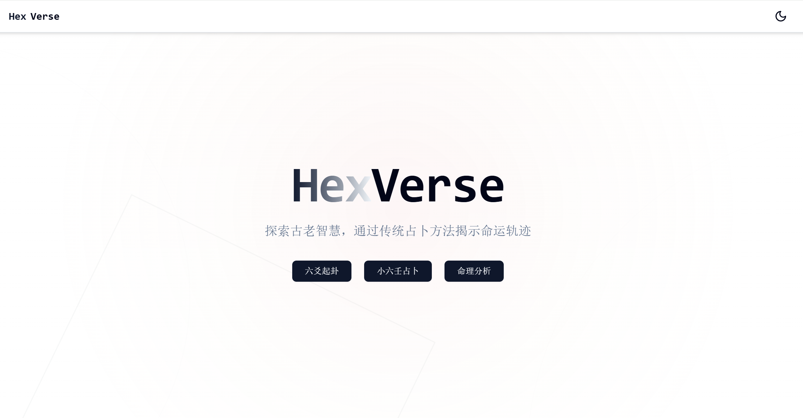

# HexVerse

_AI与玄学的结合，体验地址👉[HeVerse](https://hexverse.luckyabner.top/)_

## 技术栈

- Next.js
- Tailwind CSS
- Vercel AI SDK
- 火山引擎 API

## 功能

- 小六壬
- 六爻
- 命理分析

## 部署指南

1. 克隆仓库
2. 安装依赖：`pnpm install`
3. 根据env.example创建.env文件，填入相关变量
4. 运行开发服务器：`pnpm dev`

## LICENSE

This project is licensed under the [MIT License](LICENSE)
